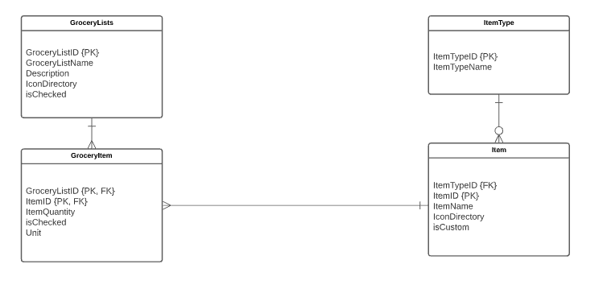

# Design Document

**Author**: CSCI 370 Spring 21 Section 34 Team 6

## 1. Design Considerations

### 1.1 Assumptions

Database: Need an implementation of it that keeps track of items as well as the multiplelists. A major problem is that none of us really have any experience when it comes down to using android studio let alone implementing a database.

Android Studio: This IDE as mentioned earlier is new and foreign to all of us, thus implementation of different activity pages won't be similar from one person to another. Combining them will involve a lot of fixing if the codes are in conflict with one another.

### 1.2 Constraints

When it comes to hardware, there isn't really any as this application is simple in nature, as it doesn't take much RAM or even storage space in order for it to function on an android device.

Data is stored locally on the device hence users will not be able to access their grocery list from another device.

### 1.3 System Environment

Software: Android, at least api level 21

Hardware: ARMv7 and ARMv8-A architectures

## 2. Architectural Design

### 2.1 Component Diagram

### 2.2 Deployment Diagram

Working on this project, the main concern that appeared to us would be the implementation of a database. The scale at which this application is being designed at doesn't include an online platform where we can host the database, thus it will be stored locally on an user's device in the preliminary stages. Future implementation may include user login which supports multiple users should the application be hosted online.

## 3 Low-Level Design

Each of the system components provided in the previous section will have its internal structure explained in the following UML diagram. 

### 3.1 Class Diagram

The class diagram provided was created during the Unified Software Process' inception phase.

### 3.2 Other Diagrams

#### Entity-Relationship Diagram

We have structured an entity-relationship diagram in order to display how our classes represent concrete data which the user will be able to interact with. It is also a helpful reference for team members when implementing the database.

## 4 User Interface Design

Initial UI that we settled on prior to working on the coding portion:

Final UI after modifications:

### 4.1 Wireframe Design

Wireframe to show where each button will bring the user to.

